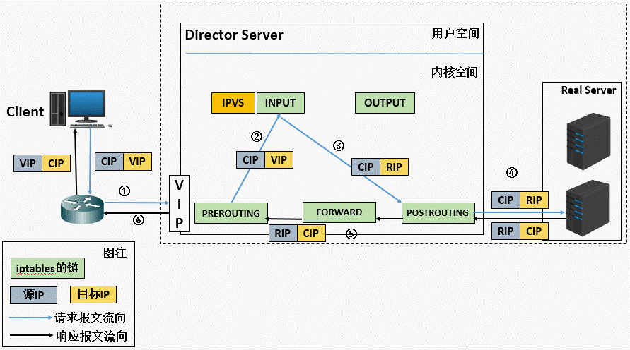

# 集群基础

## 集群前内容

### 流量相关(24h 之内)

**PV：** (page view) 即页面浏览量或点击量，页面刷新就+1。
**UV:** (unique visitor) 独立访客，以浏览器缓存的 cookie 为依据，不同 cookie 则+1。
**IP:** 可理解为一个独立 IP 产生的访问，每个独立 IP 则+1。

> 一般来说： PV > UV > IP
> IP 和 UV 之间的数据不会有太大的差异，通常 UV 量和比 IP 量高出一点，每个 UV 相对于每个 IP 更准确地对应一个实际的浏览者。

## 性能扩展

分为垂直扩展（同样的计算资源池，增加硬件配置）、水平（横向）扩展（向计算平台加入更多机器或设备）。

> 集群就是一种水平扩展

## 集群概述

### What's 集群

集群是一组相互独立的，通过网络互联的计算机，构成了一个组，并以单一系统的模式加以管理。对客户机来说，集群像是一个独立的服务器。集群配置为服务器提高了可用性和可缩放性。
通过集群，可付出较低成本，获得性能、可靠性、灵活性方面相对较高的收益。

> 简单总结为：一组协同工作但对外表现为一个整体的服务器组。

集群系统的优点：

- 高扩展性
- 高可用性
- 高性能
- 高性价比

> 负载与分布式的区别：
>
> - 负载是做同类事情的一组设备，多台访问缓解单台压力
> - 分布式是做不同事情的设备，之间互相协作提供更完整的服务

### 集群分类

- LBC：负载均衡集群
- HAC：高可用性集群
- HPC：高性能计算集群（科学计算集群）

## LBC(Load Balancer Cluster) 负载均衡集群

### LBC 概念

两个及以上的服务实体协调配合完成一系列工作的模式，对外表现为一个整体。

### LBC 目的

提高业务性能，降低单台服务器压力。

### LBC 特征

不同节点之间相互独立，不共享任何硬件资源；通过一定算法将客户端的访问请求分配到群集的各个节点上，充分利用每个节点的资源。负载均衡扩展了网络设备和服务器带宽，增加吞吐量，加强网络数据处理能力。

### LBC 实现方式

- 硬件：单独的硬件设备（独立专门的操作系统）F5（BigIP） A10（Thunder 系列） redware
- 软件：DNS、LVS、Nginx、RAC、Haproxy 等。
  - LVS：是 Linux Virtual Server 的缩写，名为 Linux 虚拟服务器，中国最早的纳入 Linux 内核的应用层程序。
  - RAC：是 real application clusters 的缩写，名为实时应用集群，是 Oracle 的负载调用软件。

> DNS 将同一个域名解析为多个不同 IP。
> DNS 的解析缓存造成任务分配不均，导致单个服务器压力过大。
> 无法实现健康状态检查、缓存 dns 无法实现分配用户请求。

### LBC 负载算法

**静态算法：**

- RR(Round-Robin) 轮询，从 1 开始到 n 结束。
- WRR(Wight-Round-Robin) 权重（加权轮询），按权重比例进行调度，权重越大，负责的请求越多。
- SH 源地址 HASH，实现会话绑定，保留之前建立的会话信息，将来自于同一个 IP 地址的请求发送给同一个真实服务器，降低频繁请求时连接的次数。
- DH 目标地址 HASH，将同一个目标地址的请求，发送给同一个服务器节点，提高缓存命中率。

**动态算法：**

- LC 最少连接，将新的连接请求分配给当前连接数最少的服务器（判断依据为相应算法公式：活动连接\*256+非活动连接）（256 为一个包在网络中最大的跃点数）。
- WLC 加权最少连接（公式：(活动连接\*256+非活动连接)/权重）。
- SED 最短期望延迟，加权最少连接的特殊模式（公式：(活动连接+1)\*256/权重）。
- NQ 永不排队，SED 的特殊模式，当某台真实服务器的连接数为 0 时，直接分配，不计算（一般用于新加入的 RS，当其活动连接数与其他 RS 持平后，再使用其他正常负载算法）。
- LBLC 基于局部性的最少连接，dh 的特殊模式，既要提高缓存命中率，又要考虑连接数量。先根据请求的目标 IP 地址寻找最近的该目标 IP 地址所有使用的服务器，如果这台服务器依然可用，并且有能力处理该请求，调度器会尽量选择相同的服务器，否则会继续选择其它可行的服务器。
- LBLCR 带复制的基于局部性的最少连接，LBLCR=LBLC+缓存共享机制。

> **静态算法：** 仅考虑算法合理性，不考虑单台服务器的当前承载能力。
> **动态算法：** 还会考虑被分配服务器的状态，承受能力等，进行动态的负载。

### LBC 结构

- agent：负载调度器
- 业务层：服务器池
- 存储：共享存储

> 为了保证多个负载服务器数据一致性：
> 存储在负载服务器本地，使用同步功能同步数据，会有延迟。
> 使用统一共享存储，数据读写均交给外部服务器。

### LBC 层级

- 硬件：二层、四层、七层
- 软件：
  - 四层（传输层）负载调度器：LVS、RAC
  - 七层（应用层）负载调度器：mysql proxy、RAC、nginx、haproxy

> 四层与七层区别：
>
> - 触发条件不同
>   - 四层负载调度器（以下简称四层）：工作在传输层，转发数据依靠的是三层的 IP 和四层的 PORT。
>   - 七层负载调度器（以下简称七层）：工作在应用层，转发数据依靠 URL 或主机名(FQDN)。
> - 实现原理不同
>   - 四层：TCP 连接建立一次，在客户端和真实服务器之间。
>   - 七层：TCP 连接建立两次，分别为客户端和负载调度器、负载调度器和真实服务器。
> - 应用场景不同
>   - 四层：TCP 应用为主，应用于 OA、ERP。
>   - 七层：HTTP 协议为主，根据用户访问页面进行判断调度。
> - 安全性不同
>   - 四层：转发 SYN 攻击。
>   - 七层：拦截 SYN 攻击。

### LVS(Linux Virtual Server)

IPVS：钩子函数，内核机制，在请求没有到达目的地址之前，捕获并取得优先控制权的函数。

IPVSADM：工作在用户空间，负责为 ipvs 内核框架编写规则，定义谁是集群服务，谁是后端真实的服务器。

> LVS 的工作模式与防火墙十分相似，捕获数据包，并根据设定的规则决定数据包的去留走向。

#### 工作模式

LVS 工作模式有：

- 地址转换模式，NAT，Masq，`-m`(`--masquerading`)
- 直接路由模式，DR，Route，`-g`(`--gatewaying`)
- 隧道模式，TUN，Tunnel，`-i`(`--ipip`)

> 隧道模式用于跨区域的 RS 做负载，在原有 ip 数据包的基础上需要再次进行 ip 封装（隧道技术），需要负载器和真实服务器支持隧道。

最常用的负载模式还是 DR 直接路由模式。

> 名词：
>
> - CIP：客户端 IP
> - DIP：负载调度器 IP
> - VIP：集群 IP
> - RIP：真实服务器 IP

#### NAT 地址转换模式

##### NAT 工作流程

1. 客户端将请求交给负载调度器，客户端发出数据包，此时这个数据包的源 IP 为 CIP，目标 IP 为 VIP。
2. 数据包到达负载调度器后，修改数据包的目标 IP 地址为真实服务器的 ip，此时数据包的源 IP 为 CIP，目标 IP 为 RIP。
3. 将数据包发送给 RS，之后 RS 响应将数据包发挥给负载调度器，此时数据包的源 IP 为 RIP，目标 IP 为 CIP。
4. 负载调度器在转发时，会将源 ip 地址改为自己的 VIP 地址，然后再发给客户端，此时数据包的源 ip 为 VIP，目标 ip 为 CIP。

##### NAT 特点

1. 负载调度器和真实服务器，必须位于同一网络（可能位于同一物理空间）。
2. 真实服务器的网关必须指向 DIP（即负载服务器必须充当真实服务器的路由）。
3. 负载调度器必须位于客户端和真实服务器之间。
4. RIP 通常都是私有地址，仅用于各个集群节点通信。
5. 支持端口映射。
6. 真实服务器可以使用任意操作系统，负载调度器必须是 LINUX 系统。

##### NAT 缺点

所有数据报文都要经过负载调度器，压力过大，导致承载量受到限制。

#### DR 直接路由模式

##### DR 工作流程

1. 客户端发出数据包，源 IP 为 CIP，目标 IP 为路由器对外公网 IP。
2. 依靠路由（防火墙 DNAT 将目标 IP 从路由器公网 IP 转换为 VIP）把数据据发送给负载调度器，负载调度器根据 ipvs 规则做直接路由，将数据包的源 MAC 地址（本图中应为路由器 2 口的 MAC）修改为 DIP 的 MAC 地址，将目标 MAC 修改为 RIP 的 MAC 地址，经过负载器时，源 IP（CIP）和目标 IP（VIP）均未被修改。
3. 修改了源 MAC 和目标 MAC，使得数据包通过二层同网段传输，将数据包发给 RS。
4. RS 接收数据包，因为 lo 网卡设置了 VIP，能正确接收拆包，建立 TCP 连接，并返回数据包。
5. 返回包的源 IP 和目标 IP 进行倒转，（VIP---CIP）。不通过负载器，直接通过路由返回（路由器根据规则做 SNAT，将源 IP 转换为路由器对外公网 IP），在客户端来看则一直是他与路由器的公网 IP 通信。

##### DR 特点

1. 负载调度器和真实服务器，必须位于同一网络。
2. 真实服务器的网关必须指向路由器。
3. 负载调度只处理入站请求。
4. RIP 通常是私有地址。
5. 真实服务器可以使用任意操作系统，负载调度器必须是 LINUX 系统。

##### DR 优缺点

- 优点：负载调度器压力较小，支持 100 台左右的 RS。
- 缺点：配置相对复杂。

## HAC(High Availability Cluster) 高可用性集群

### HAC 目的

最大限度保证用户的应用程序持久、不间断地提供服务（故障转移）。
尽量通过缩短系统停机时间（因日常维护操作，或突发的系统崩溃等），以提高系统和应用的可用性。

### HAC 原理

一般是 2 个节点做出的 HA 集群，俗称“双机热备”或“双机互备”。一台主一台从，正常情况主工作，从探测主的状态（心跳检测）；主宕机时，从接收不到主存活的消息，就会接管主的相应资源，顶替主继续对外提供服务；主恢复时，从将资源释放，使主能正常工作，回到正常状态。

### 服务器全年可用百分比对应允许宕机的最大总时间

| 可用百分比 | 允许宕机时间/年 |
| ---------- | --------------- |
| 99%        | 87.6h           |
| 99.9%      | 8.8h            |
| 99.99%     | 53m             |
| 99.999%    | 5m              |

> 一般最低要求为全年可用 99.99%

### HAC 软件

Rose Haproxy、Keepalived、Heartbeat

### 脑分裂及解决

**脑分裂：**

在一个网络或线缆故障时（心跳线路出现问题）导致两个节点同时认为自己是唯一处于活动状态的服务器，从而出现争用资源的情况，即为“脑裂”，造成数据不完整，服务不可访问的情况。

**解决：**

- 设置参考 IP，抢夺资源之前，测试自己与参考 IP（如网关）的连通性，当 PING 不通时（发现可能是整个网络线路出问题，就算抢占了资源也无用），不去抢资源，将资源释放，交出控制权。
- 设置冗余心跳线路，设置两条心跳线，两个网卡，第一条线路测若不通，使用第二条线路再测。
- stonish 或 feyce 等特殊设备支持，当检测到脑裂时强行关闭一个心跳节点，避免脑裂发生。
- 做好脑裂的监控警报，尽早人为干预介入，解决脑裂问题。

#### Keepalived 概述

Keepalived 软件起初是专为 LVS 负载均衡软件设计的，用来管理并监控 LVS 集群系统中各个服务节点的状态（健康检查），
后来又加入了可以实现高可用的 VRRP 功能（故障切换）。因此，Keepalived 除了能够管理 LVS 软件外，还可以作为其他服务（例如：Nginx、Haproxy、MySQL 等）的高可用解决方案软件。

#### Keepalived 模块

Keepalived 采用是模块化设计，不同模块实现不同的功能；Keepalived 主要有三个模块，分别是 core、check 和 vrrp。

- **core：** 是 keepalived 的核心，负责主进程的启动和维护，全局配置文件的加载解析等。

- **check：** 负责 healthchecker(健康检查)，包括了各种健康检查方式，以及对应的配置的解析包括 LVS 的配置解析；可基于脚本检查对 IPVS 后端服务器健康状况进行检查。

- **vrrp：** VRRPD 子进程，VRRPD 子进程就是来实现 VRRP 协议的。

#### Keepalived 配置文件

Keepalived 配置文件为：`keepalived.conf`，主要有 全局配置、VVRPD 配置，LVS 配置 三个配置区域。

全局配置又包括 全局定义、路由配置 两个子配置。

#### VRRP 工作原理

Keepalived 高可用对之间是通过 VRRP 进行通信的。VRRP 是通过竞选机制来确定主备的。主的优先级高于备，因此工作时主会优先获得所有的资源，备节点处于等待状态；当主宕机的时候，备节点就会接管主节点的资源，然后顶替主节点对外提供服务。

在 Keepalived 服务对之间，只有作为主的服务器会一直发送 VRRP 广播包,告诉备它还活着，此时备不会抢占主，当主不可用时，即备监听不到主发送的广播包时，就会启动相关服务接管资源，提高接管速度，保证业务的连续性。
