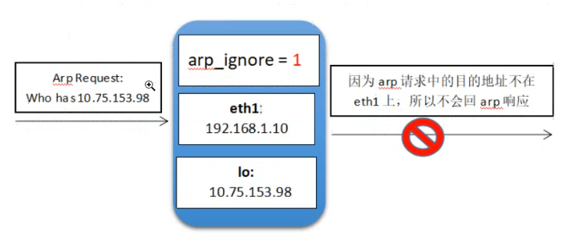
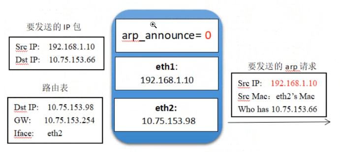
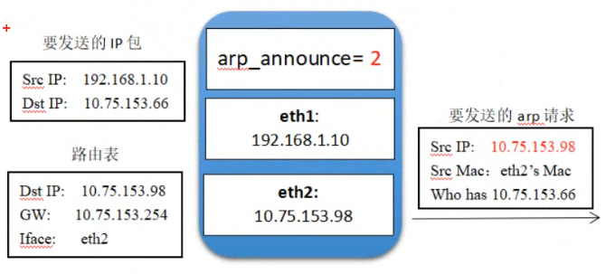

# LVS-DR 实验步骤

## 实验规划

准备 5 台虚拟机

VIP 指定为`192.168.16.200`

| 虚拟机名称 | 作用       | 网卡            | IP 地址                           | 网关             | 操作内容                              |
| ---------- | ---------- | --------------- | --------------------------------- | ---------------- | ------------------------------------- |
| Mk.I       | 路由器     | vmnet2,vmnet3   | `192.168.17.101`,`192.168.16.101` | -                | 路由转发,防火墙规则                   |
| Mk.II      | 负载调度器 | vmnet3,vmnet3:0 | `192.168.16.102`,`192.168.16.200` | `192.168.16.101` | ens33 子网卡,关闭路由重定向,ipvs 规则 |
| Mk.III     | RS1        | vmnet3          | `192.168.16.103`,`192.168.16.200` | `192.168.16.101` | httpd,index 文件,lo:0 子网卡          |
| Mk.IV      | RS2        | vmnet3          | `192.168.16.104`,`192.168.16.200` | `192.168.16.101` | httpd,index 文件,lo:0 子网卡          |
| Mk.V       | 客户端     | vmnet2          | `192.168.17.105`                  | `192.168.17.101` | -                                     |

## 实验步骤

1. 为每台虚拟机配置好对应的网卡，以及根据实验规划，配置相应的子网卡。

   - 负载调度器 DIP 的网卡添加子网卡，设置 IP 为 VIP(192.168.16.200)。

     ```bash
     cp -a /etc/sysconfig/network-scripts/ifcfg-ens* /etc/sysconfig/network-scripts/ifcfg-ens*:0
     #复制网卡配置为子网卡
     vim /etc/sysconfig/network-scripts/ifcfg-ens*:0
         DEVICE=ens*:0
         NAME=ens*:0
         IPADDR=192.168.16.200
         PREFIX=24
         GATEWAY=192.168.16.101
     #编辑子网卡内容，注意修改设备名

     ```

   - 真实服务器的 lo 本地回环网卡添加子网卡，设置 IP 为 VIP。

     ```bash
     cp -a /etc/sysconfig/network-scripts/ifcfg-lo /etc/sysconfig/network-scripts/ifcfg-lo:0
     vim /etc/sysconfig/network-scripts/ifcfg-lo:0
         DEVICE=lo:0
         IPADDR=192.168.16.200
         NETMASK=255.255.255.255
     #注意将掩码修改为4个255，使得其网段仅有一个主机，避免产生广播
     ```

   记得重启网卡 `systemctl restart network`

2. 为路由器开启路由转发、负载调度器关闭路由重定向、真实服务器开启 arp 响应忽略和 arp 通告避免。

   - 路由器开启路由转发

     ```bash
     vim /etc/sysctl.conf
         net.ipv4.ip_forward = 1
     #开启路由转发功能
     sysctl -p
     #使配置写入内存并生效
     ```

   - 负载调度器关闭路由重定向

     ```bash
     vim /etc/sysctl.conf
         net.ipv4.conf.all.send_redirects = 0
     #关闭路由重定向，避免将某些访问请求重定向使得负载规则无效
     sysctl -p
     #使配置写入内存并生效
     ```

   - 真实服务器 arp 响应和通告相关设置

     ```bash
     vim /etc/sysctl.conf
         net.ipv4.conf.all.arp_ignore = 1
         net.ipv4.conf.all.arp_announce =2
     sysctl -p
     #使配置写入内存并生效
     ```

     > - `arp_ignore` 是否响应 arp 请求：
     >   - `0` 只要本机配置有 arp 请求的 IP，就响应（回复 MAC 地址），这样会造成 VIP 与 MAC 地址绑定的混淆
     >   - `1` 仅在 arp 请求的 IP 配置在 arp 请求到达的接口上时，才会响应（即 arp 请求的端口上不是请求的 IP 就不响应）
     >
     > 
     >
     > - `arp_announce` 是否对外通告 MAC 地址信息
     >   - `0` 发送 IP 包前，发起的 ARP 请求（用于获取目标 IP 的 MAC 地址信息）的源 IP 信息采用发送 IP 包的源 IP（在本实验中即 VIP，这样会造成 VIP 与 MAC 地址绑定的混淆）
     >   - `1` 尽可能避免向目标网络通告与其网络不匹配的地址信息
     >   - `2` 发送 IP 包前，发起的 ARP 请求，的源 IP 信息采用发出网卡的 IP 地址（在本实验中即真实服务器的 ens33 网卡 IP）
     >
     > 
     >
     > 

3. 配置好 yum 源，每台设备安装对应软件服务，及软件配置

   - 路由器：配置防火墙规则，将对公网地址的指定端口访问指定到负载服务器 VIP 指定端口

     ```bash
     iptables -t nat -A PREROUTING -d 192.168.17.101 -p tcp --dport 80 -j DNAT --to-destination 192.168.16.200:80
     # -t nat 指定nat表
     # -A PREROUTING 指定添加PREROUTING链的规则：
         # -d 目标IP为路由器对外公网IP
         # -p tcp 端口协议为TCP
         # --dport 80 目标端口为80
         # -j DNAT 满足以上规则的数据包，采用DNAT策略，进行目标地址转换
         # --to-destination VIP:80 将目标地址转换为VIP:80

     iptables -t nat -A POSTROUTING -s 192.168.16.0/24 -p tcp --sport 80 -j SNAT --to-source 192.168.17.101:80
     #类似上面描述，是对应的数据包转出服务器集群的规则，将内网网段内任意向外发送的TCP80端口的数据包进行源地址转换，转换为对外公网IP:80
     ```

   - 负载调度器：配置负载规则

     ```bash
     yum -y install ipvsadm

     ipvsadm -A -t 192.168.16.200:80 -s rr
     # -A 添加负载集群
     # -t 指定端口协议为TCP
     # 指定VIP:PORT
     # -s 指定负载算法，例如rr和wrr
     ipvsadm -a -t 192.168.16.200:80 -r 192.168.16.103:80 -w 1 -g
     # -a 添加指定集群下的真实服务器负载规则
     # -r 指定要负载到的真实服务器的IP:PORT
     # -w 指定本条真实服务器规则的负载算法权重数
     # -g 表明本条真实服务器规则采用DR直接路由方式处理
     ```

   - 真实服务器：httpd WEB 服务器

     ```bash
     yum -y install httpd
     echo "RS1" > /var/www/html/index.html
     #不同服务器写不同的主页内容，使得访问时加以区分
     systemctl start httpd
     ```

4. 使用客户端进行测试

   ```bash
   curl 192.168.17.101

   while true; \
   do \
       sleep 1; \
       curl 192.168.17.101; \
   done
   ```

## 使用 keepalived 做负载调度器的高可用（热备）

1. 再添加一台设备，采用和原负载调度器相同的配置，但删掉两个负载调度器的子网卡 ens33:0

2. yum 安装 keepalived 服务，并配置好配置文件

   ```bash
   yum -y install keepalived

   vim /etc/keepalived/keepalived.conf
    gloal_defs {
        router_id LVS_MASTER
    }

    vrrp_instance VI_1 {
    #vvrp为可用性探测功能相关配置，负责探测同集群设备是否可用（主客观）
        state MASTER
        #指定主从MASTER|SLAVE
        interface ens33
        #指定要配置VIP的网卡名
        virtual_router_id 51
        #指定虚拟路由的标识id，同一高可用集群的id需要相同
        priority 100
        #指定高可用优先级，显然主需要大于从
        advert_int 1
        authentication {
            auth_type PASS
            auth_pass 1111
        }
        #不配置也不删除验证配置
        virtual_ipaddress {
            192.168.16.200/24
            #填写VIP，可以使用掩码位
        }
    }

    virtual_server 192.168.200 80 {
    #此为自动配置ipvs相关规则内容，虚拟服务器IP为VIP，端口为80
        delay_loop 6
        lb_algo rr
        #指定负载算法为rr
        lb_kind DR
        #指定负载规则类型为DR
        persistence_timeout 0
        #指定持续时间，改为0便于尽快看到主从切换效果
        protocol TCP
        #指定协议为TCP

        real_server 192.168.16.103 80 {
        #此为配置ipvs规则下的真实服务器，IP为RIP，端口为80
            weight 1
            #权重为1
            connect_timeout 3
            nb_get_retry 3
            delay_before_retrey 3
        }

        real_server 192.168.16.104 80 {
            weight 1
            connect_timeout 3
            nb_get_retry 3
            delay_before_retrey 3
        }
    }
   ```

3. 开启 keepalived 服务，使用客户端持续发送访问请求，然后断开主负载网络连接，查看切换到从负载的切换过程
