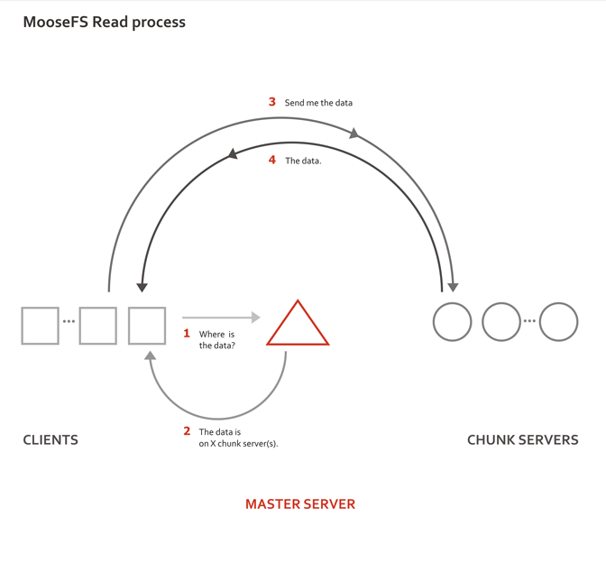

# 分布式对象存储

分布式文件系统（Distributed File System）是指文件系统管理的物理存储资源不一定直接连接在本地节点上，而是通过计算机网络与节点相连。分布式文件系统的设计基于客户机/服务器模式。一个典型的网络可能包括多个供多用户访问的服务器。

## MooseFS(MFS)特点

- Free(GPL)通用文件系统。
- 可在线扩容。
- 部署简单。
- 文件高可用，可设置相比 raid10 更高文件冗余级别，而不影响文件读写性能（但降低利用率）。
- 有回收站功能，可以即时回滚误删文件。
- 具有文件快照功能。

## MFS 工作原理及设计架构

| 角色                                | 角色作用                                                                                                                 |
| ----------------------------------- | ------------------------------------------------------------------------------------------------------------------------ |
| 管理服务器(Master Server)           | 负责各个数据存储服务器的管理，文件读写调度，文件空间回收以及恢复、多节点拷贝。                                           |
| 元数据日志服务器(Metalogger Server) | 负责备份管理服务器的变化日志文件，文件类型为`changelog_ml.*.mfs` ，以便于在 Master Server 出问题的时候提供数据找回功能。 |
| 数据存储服务器(Chunk Servers)       | 负责连接管理服务器，听从管理服务器调度，提供存储空间，并为客户提供数据传输。                                             |
| 客户机(Client)                      | 通过 fuse 内核接口挂接远程管理服务器上所管理的数据存储服务器，看起来共享的文件系统和本地 UNIX 文件系统使用一样的效果。   |



### MFS 读数据过程

- Client 需要数据时，首先向 Master Server 发起查询请求。
- Master Server 检索自己数据索引，获取到数据所在的可用 Chunk Server 位置(IP|Port|ChunkID)。
- Master Server 将 Chunk Server 的地址发给 Client。
- Chunk Server 将数据发送给 Client。

### MFS 写数据过程

- Client 有写需求时，首先向 Master Server 提供文件元数据信息(文件名|大小|份数)，请求存储地址。
- Master Server 根据写文件的元数据信息，到 Chunk Server 创建新的数据块。
- Chunk Server 返回创建成功消息。
- Master Server 将数据服务器的地址返回给 Client(ChunkIP|Port|ChunkID)。
- Client 向数据服务器写数据。
- 数据服务器返回给 Client 写成功的消息。
- Client 将此次写完成结束信号和一些信息发送到 Master Server 来更新文件的长度和最后修改时间。

### MFS 删改文件过程

- Client 有删除操作时，首先向 Master Server 发送删除信息。
- Master Server 定位到相应元数据信息进行删除，并将 Chunk Server 上块的删除操作加入队列异步清理。
- Master Server 响应给 Client 删除成功的信号。

### MFS 修改文件内容过程

- Client 有修改文件按内容时，首先向 Master Server 发送操作信息。
- Master Server 申请新的块给.swp 文件，Client 关闭文件后，会向 Master Server 发送关闭信息。
- Master Server 会检测内容是否有更新，若有，则申请新的块存放更改后的文件，删除原有块和.swp 文件块；若无，则直接删除.swp 文件块。

### MFS 重命名文件的过程

- Client 重命名文件时，会向 Master Server 发送操作信息。
- Master Server 直接修改元数据信息中的文件名。
- Master Server 返回重命名完成信息。

### MFS 遍历文件的过程

- 遍历文件不需要访问 Chunk Server，当有 Client 遍历请求时，向 Master Server 发送操作信息。
- Master Server 返回相应元数据信息。
- Client 接收到信息后显示。

## MFS 安装部署实验

### 实验规划

**Master 使用 9419、9420、9421 端口分别连接 Metalogger、Chunk、Client，注意开放防火墙端口。**

| IP             | 身份              |
| -------------- | ----------------- |
| 192.168.43.101 | Master Server     |
| 192.168.43.102 | Metalogger Server |
| 192.168.43.103 | Chunk Server 1    |
| 192.168.43.104 | Chunk Server 2    |
| 192.168.43.105 | Chunk Server 3    |
| 192.168.43.106 | Client Server     |

源码包下载：<http://ppa.moosefs.com/src/>

四种身份安装同一个源码包，可根据身份，在`configure`时指定参数禁用多余模块

|禁用|参数|
|Master|`--disable-mfsmaster`|
|Metalogger|`--disable-mfsmetalogger`|
|Chunk|`--disable-mfschunkserver`|
|Client|`--disable-mfsmount`|

### 统一执行安装步骤

```bash
yum -y install gcc zlib-devel
# 客户端额外需要安装fuse fuse-devel fuse-libs
useradd -r -s /sbin/nologin mfs
# 先创建mfs服务用户，用于后续指定
./configure --prefix=/usr/local/mfs --with-default-user=mfs --with-default-group=mfs --disable-看注释
# 继续在后面指定要禁用的模块，如 --disable-mfsmaster --disable-mfsmetalogger --disable-mfschunkserver --disable-mfsmount
make && make install
ln -s /usr/local/mfs/bin/* /usr/local/bin
ln -s /usr/local/mfs/sbin/* /usr/local/sbin/*
# 软链接，方便后续操作
```

### Master Server

```bash
cp -a /usr/local/mfs/etc/mfs/mfsmaster.cfg.sample /usr/local/mfs/etc/mfs/mfsmaster.cfg
cp -a /usr/local/mfs/etc/mfs/mfstopology.cfg.sample /usr/local/mfs/etc/mfs/mfstopology.cfg
cp -a /usr/local/mfs/etc/mfs/mfsexports.cfg.sample /usr/local/mfs/etc/mfs/mfsexports.cfg
# 复制生成管理服务器的三个配置文件，默认即可，无需修改内容
cp -a /usr/local/mfs/var/mfs/metadata.mfs.empty /usr/local/mfs/var/mfs/metadata.mfs
# 复制生成数据元文件

mfsmaster start
# 管理 Master Server 服务命令

ss -antp | grep "mfsmaster"
# 可以验证监听的9419,9420,9421端口，以及已经建立连接的其他服务器与客户端
```

### Metalogger Server

```bash
cp -a /usr/local/mfs/etc/mfs/mfsmetalogger.cfg.sample /usr/local/mfs/etc/mfs/mfsmetalogger.cfg
# 复制生成元数据日志服务器配置文件

vim /usr/local/mfs/etc/mfs/mfsmetalogger.cfg
    META_DOWNLOAD_FREQ = 2
    # 元数据备份文件下载请求频率，默认是24小时，修改后为每2小时从master server上下载一个metadata.mfs文件，当元数据服务器关闭或者故障的时候，metadata.mfs.back文件将消失，此时需要从元数据日志服务器中取得这个文件。注意，这个文件和日志文件共同使用才能恢复整个已损坏的分布式文件系统...只需要更改上面2行就行了，其他保持默认即可如果没有特殊要求。
    MASTER_HOST = 192.168.43.101
    # 指明 Master Server 的主机地址

mfsmetalogger start
# 管理 Metalogger Server 服务命令

ls -l /usr/local/mfs/var/mfs/
# 查看工作目录下是否有元数据文件
```

### Chunk Server

前提步骤：加硬盘、分区、格式化、本地挂载、修改挂载点所有者和所属组为 mfs

> 注：通过启用 xfs 模块，并安装`xfsprogs`包，让 CentOS 6 支持 xfs 文件系统  
> `lsmod` 列出所有已启用的内核模块。  
> `modprobe` 将指定模块加载并启动。  
> `modinfo` 显示指定模块的详细信息。

```bash
cp -a /usr/local/mfs/etc/mfs/mfschunkserver.cfg.sample /usr/local/mfs/etc/mfs/mfschunkserver.cfg
cp -a /usr/local/mfs/etc/mfs/mfshdd.cfg.sample /usr/local/mfs/etc/mfs/mfshdd.cfg
# 复制生成数据存储服务器配置文件

vim /usr/local/mfs/etc/mfs/mfschunkserver.cfg
    MASTER_HOST 192.168.43.101
    # 指明 Master Server 的主机地址
    HDD_CONF_FILENAME = /usr/local/mfs/etc/mfs/mfshdd.cfg
    # 指明配置共享磁盘的配置文件

vim /usr/local/mfs/etc/mfs/mfshdd.cfg
    /sdb1
    # 指定挂载点，或设备文件，作为MFS的数据存储设备

mfschunkserver start
# 管理 Chunk Servers 服务命令
```

### Client

```bash
mkdir /mfs_client
# 准备好要挂载到的目录
mfsmount /mfs_client -H 192.168.43.101
# -H 指定 Master Server 的主机地址
# 挂载成功
```

## MFS 高级特性

### MFS 设置 goal 冗余(副本)

goal 指文件被拷贝的份数，使用 `mfssetgoal 数量 文件` 进行备份数设置，使用 `mfsgetgoal 文件` 查看 goal，使用 `mfsrsetgoal` 更改备份数设置。

```bash
mfssetgoal 2 a.txt
mfsgetgoal a.txt
mfssetgoal -r 3 a.txt
```

### MFS 回收站

一个已被删除的文件存放在回收站的时间就是一个隔离时间，可以用`mfsgettrashtime`和`mfssettrashtime`命令设置和查看。

> 时间的单位是秒(有用的值有:1 小时是 3600 秒,24 - 86400 秒,1 周 - 604800 秒)。就像文件被存储的份数一样, 为一个目录设定存放时间是要被新创建的文件和目录所继承的。数字 0 意味着一个文件被删除后, 将立即被彻底删除，再想回收是不可能的。

删除文件可以通过一个单独挂载的 MFSMETA 文件系统。特别是它包含目录/trash (包含可以被还原的被删除文件的信息)和/trash/undel (用于获取文件)。只有管理员有权限访问 MFSMETA(用户的 uid 0，通常是 root)。

```bash
mfsmount -m /mfs_meta -H 192.168.43.101
# 在客户端挂载回收站
```

被删文件的文件名在“垃圾箱”目录里还可见,文件名由一个八位十六进制的数 i-node 和被删文件的文件名组成，在文件名和 i-node 之间不是用`/`,而是用了`|`替代。如果一个文件名的长度超过操作系统的限制（通常是 255 个字符），那么部分将被删除。通过从挂载点起全路径的文件名被删除的文件仍然可以被读写。

```bash
find /mfs_meta -name a.txt
# 使用find命令在回收站中搜索被删除文件的存放位置
mv /some/path/to/file/a.txt /some/path/to/file/undel/
# 通过将被删除文件移动到同目录下undel文件夹中来恢复文件，传送门很神奇吧
```

移动这个文件到 `trash/undel` 子目录下，将会使原始的文件恢复到正确的 MooseFS 文件系统的路径下（如果路径没有改变）。如果在同一路径下有个新的同名文件，那么恢复不会成功。

### MFS 启动和关闭

#### 安全启动 MFS 集群（避免任何读写错误数据等类似问题）

1. 启动 `mfsmaster` 进程。
2. 启动所有的 `mfschunkserver` 进程。
3. 启动 `mfsmetalogger` 进程。
4. 当所有的 Chunk Servers 连接到 Master Server 之后，任何数目的客户端可以利用 `mfsmount` 去挂载被 export 的文件系统。（可以通过检查 Master 的日志或 CGI 监视器来查看是否所有的 Chunk Servers 被连接）。

#### 安全停止 MFS 集群

1. 在所有的客户端卸载 MFS 文件系统。
2. 使用 `mfsmaster stop` 命令停止 Master 进程。
3. 使用 `mfschunkserver stop` 命令停止 Chunk Server 进程。
4. 使用 `mfsmetalogger stop` 命令停止 Metalogger 进程。

#### MFS Master 故障修复

一旦 Master Server 崩溃（如主机或电源故障），需要最后一个元数据日志 changelog 并入主要的 metadata 中。

```bash
/usr/local/mfs/bin/mfsmetarestore -a
# 自动在从目录下恢复metadata文件
mfsmaster -a
# 此命令可以替代mfsmetarestore

/usr/local/bin/mfsmetarestore -a -d /opt/mfsmaster
# 如果 Master 数据被存储在 MFS 编译指定地点外的路径，需要利用 -d 参数指定数据路径
```

#### MFS Master 启动监控服务

```bash
/usr/local/mfs/sbin/mfscgiserv
# 开启CGI监控服务
# 使用浏览器访问 http://master:9425
```
