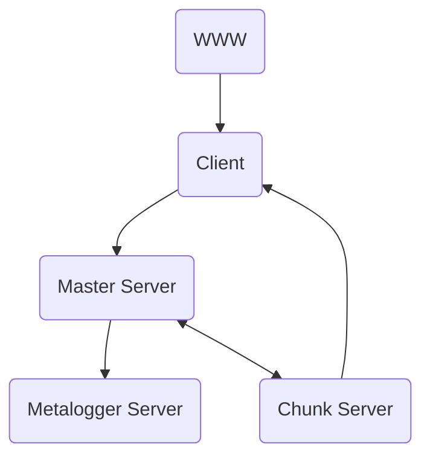
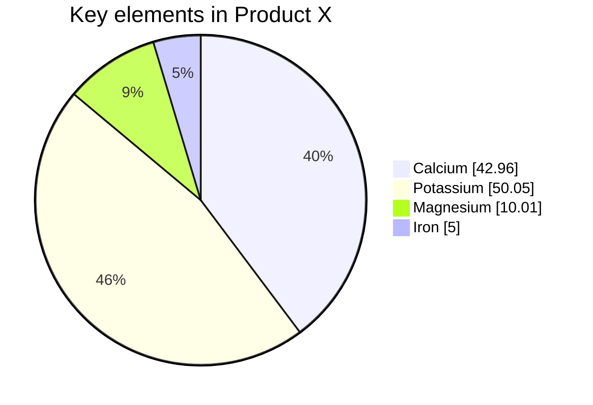

# Mermaid

```mermaid
graph TD;
    A(Client)-->B(Master Server);
    B-->C(Metalogger Server);
    B<-->D(Chunk Server);
    D-->A;
    E(WWW)-->A;
```

```mermaid
pie showData
    title Key elements in Product X
    "Calcium" : 42.96
    "Potassium" : 50.05
    "Magnesium" : 10.01
    "Iron" :  5

```
