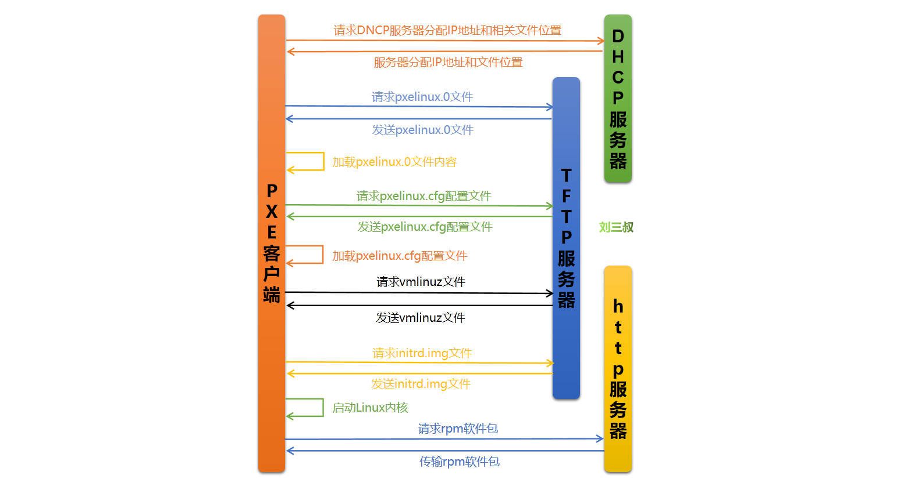
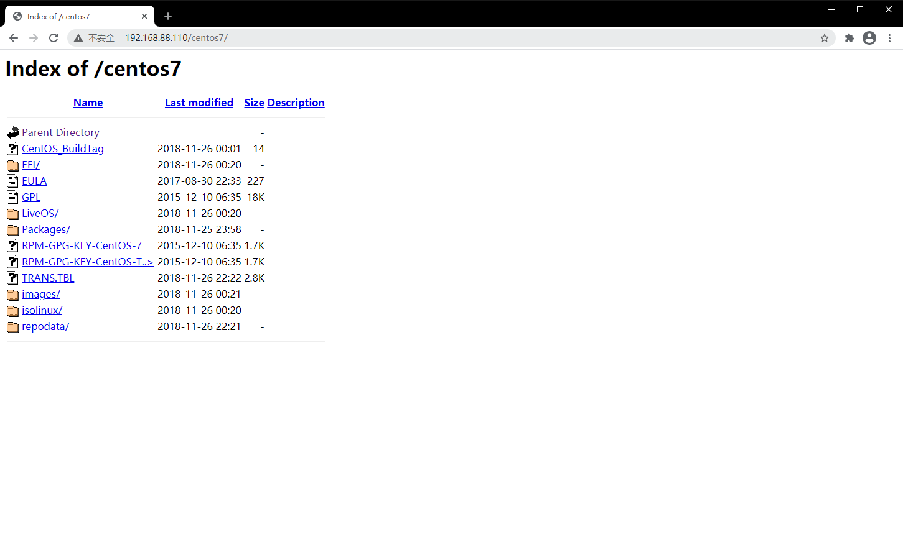
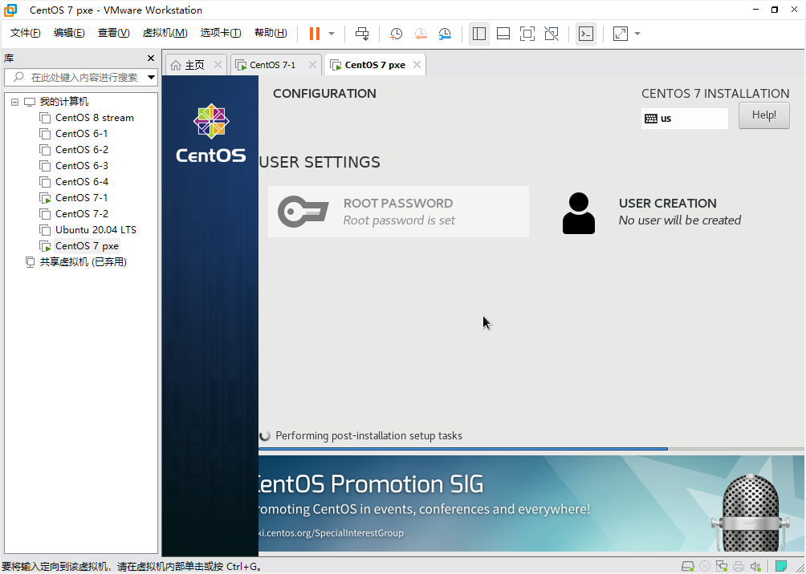

# 批量无人值守装机

## 一、简介

​ PXE(Pre-boot Execution Environment)是由 Intel 设计的协议，它可以使计算机通过网络启动。PXE 协议分为 client 和 server 两端，PXE client 在网卡的 ROM 中，当计算机引导时，BIOS 把 PXE client 调入内存执行，并显示出命令菜单，经用户选择后，PXE client 将放置在远端的操作系统通过网络下载到本地运行。PXE 在其启动过程中，客户端请求服务器分配 IP 地址，之后 PXE Client 使用 TFTP Client 通过 TFTP(Trivial File Transfer Protocol)协议下载启动安装程序所需的文件。

​ PXE 网络安装：客户机通过支持 PXE 的网卡向网络中发送请求 DHCP 信息的广播请求 IP 地址等信息，DHCP 服务器给客户端提供 IP 地址和其它信息（TFTP 服务器、启动文件等），之后请求并下载安装需要的文件。

​ Kickstart 是一种无人值守的安装方式。它的工作原理是在安装过程中记录需要人工干预填写的各种参数，并记录生成一个名为 anaconda-ks.cfg 的文件。



### PXE 工作流程：

1. PXE Client 从自己的 PXE 网卡启动，向本网络中的 DHCP 服务器索取 IP 和安装相关文件
2. DHCP 服务器返回分配给客户机的 IP 地址，以及 PXE 文件的存放位置(文件一般是放在一台 TFTP 服务器上)
3. PXE Client 向本网络中的 TFTP 服务器索取 pxelinux.0 文件
4. PXE Client 取得 pxelinux.0 文件后之执行该文件
5. 根据 pxelinux.0 的执行结果，通过 TFTP 服务器加载内核和文件系统
6. 进入安装画面, 此时可以通过选择 HTTP、FTP、NFS 方式之一进行安装相关软件包

## 二、环境准备

### 1. 环境组成

操作系统：CentOS Linux release 7.6.1810

软件工具：kickstart、dhcp、tftp-server、tftp、httpd

### 2. 防护关闭

关闭 SELinux 和 Firewalld。

SELinux：

```shell
[root@localhost ~]# sed -i 's/SELINUX=enforcing/SELINUX=disabled/g' /etc/selinux/config
```

Firewalld：

```shell
[root@localhost ~]# systemctl stop firewalld.service
[root@localhost ~]# systemctl disable firewalld.service
```

### 3. 软件安装

安装软件：httpd、dhcp、tftp-server、syslinux

```shell
[root@localhost ~]# yum -y install httpd dhcp tftp-server syslinux
```

<font color=red>注意：如果 CentOS 7 有图形界面可以安装 system-config-kickstart 软件，实现手动信件\*.ks.cfg 文件。</font>

## 三、各软件相关配置

### 1. DHCP 服务配置

#### 1.1 修改 dhcpd 服务配置文件

```shell
[root@localhost ~]# cp -a /usr/share/doc/dhcp-4.2.5/dhcpd.conf.example /etc/dhcp/dhcpd.conf
[root@localhost ~]# egrep -v "^#|^$" /etc/dhcp/dhcpd.conf
option domain-name-servers 114.114.114.114;
default-lease-time 600;
max-lease-time 7200;
log-facility local7;
subnet 192.168.88.0 netmask 255.255.255.0 {
  range 192.168.88.200 192.168.88.249;
  option domain-name-servers 114.114.114.114;
  option routers 192.168.88.2;
  default-lease-time 600;
  max-lease-time 7200;
  next-server 192.168.88.110;  #填写tftp服务器IP地址
  filename "pxelinux.0"; #填写引导文件名称
}
```

##### 1.2 启动 dhcpd 服务，并设置开机自启动

```shell
[root@localhost ~]# systemctl start dhcpd
[root@localhost ~]# systemctl enable dhcpd
```

##### 1.3 检查 dhcpd 服务启动状态

```shell
[root@localhost ~]# ss -tlunp|grep dhcpd
```

### 2. httpd 服务配置

#### 2.1 利用 http 实现光盘共享

在 http 的网页共享目录下创建新目录，并将光盘挂载到此目录，实现光盘内容共享，主要目的是操作系统安装的最后一个步骤需要安装软件。

```shell
[root@localhost ~]# mkdir /var/www/html/centos7
[root@localhost ~]# mount /dev/sr0 /var/www/html/centos7/
```

##### 2.2 启动 httpd 服务，并设置开启自启动

```shell
[root@localhost ~]# systemctl start httpd
[root@localhost ~]# systemctl enable httpd
```

##### 2.3 检查 httpd 服务启动状态，以及镜像共享情况

```shell
ss -tlunp|grep httpd
```



### 3. tftp 服务配置

tftp 服务隶属于 xinetd 服务，所以相关配置文件需要去/etc/xinetd.d/目录内查找

#### 3.1 配置 xinetd 服务下的 tftp 服务

```shell
[root@localhost ~]# vim /etc/xinetd.d/tftp
service tftp
{
        socket_type         = dgram
        protocol              = udp
        wait                     = yes
        user                     = root
        server                  = /usr/sbin/in.tftpd
        server_args          = -s /var/lib/tftpboot
        disable                 = no
        per_source           = 11
        cps                       = 100 2
        flags                     = IPv4
}
```

##### 3.2 启动 tftp.socket，并设置开机自启动

```shell
[root@localhost ~]# systemctl start tftp.socket
[root@localhost ~]# systemctl enable tftp.socket
Created symlink from /etc/systemd/system/sockets.target.wants/tftp.socket to /usr/lib/systemd/system/tftp.socket.
```

##### 3.3 启动 tftp 服务，并设置开机自启动

```shell
[root@localhost ~]# systemctl start tftp
[root@localhost ~]# systemctl enable tftp
```

##### 3.4 检查 tftp 服务启动状态

```shell
[root@localhost ~]# systemctl status tftp
● tftp.service - Tftp Server
   Loaded: loaded (/usr/lib/systemd/system/tftp.service; indirect; vendor preset: disabled)
   Active: active (running) since Fri 2021-03-12 00:50:57 CST; 1min 43s ago
     Docs: man:in.tftpd
 Main PID: 9831 (in.tftpd)
   CGroup: /system.slice/tftp.service
           └─9831 /usr/sbin/in.tftpd -s /var/lib/tftpboot

Mar 12 00:50:57 localhost.localdomain systemd[1]: Started Tftp Server.
[root@localhost ~]#
[root@localhost ~]#
[root@localhost ~]# ss -tlunp | grep ":69"
udp    UNCONN     0      0        :::69                   :::*                   users:(("in.tftpd",pid=9831,fd=0),("systemd",pid=1,fd=64))

```

### 4. 编写引导安装相关文件，放到指定位置

#### 4.1 tftp 需要共享的文件

- 引导文件 - pxelinux.0
- 内核文件 - vmlinuz initrd.img
- 引导菜单 - default{isolinux.cfg} -- 开机后选择启动项的菜单文

##### 4.2 导入必要文件到指定位置（内核文件、引导菜单文件）

```shell
[root@localhost ~]# cp -a /usr/share/syslinux/pxelinux.0  /var/lib/tftpboot/
#引导文件
[root@localhost ~]# cp -a /var/www/html/centos7/images/pxeboot/{vmlinuz,initrd.img}   /var/lib/tftpboot/
#用来预加载的内核和驱动文件，然后使用预加载内核进行系统安装
[root@localhost ~]# cp -a /var/www/html/centos7/isolinux/{vesamenu.c32,boot.msg,splash.png}   /var/lib/tftpboot/
#用来辅助完成菜单的显示
[root@localhost ~]# ls /var/lib/tftpboot/
boot.msg  initrd.img pxelinux.0  splash.png  vesamenu.c32  vmlinuz
```

##### 4.3 复制并编写引导菜单文件

```shell
[root@localhost ~]# mkdir /var/lib/tftpboot/pxelinux.cfg/
[root@localhost ~]#
[root@localhost ~]# cp -a /var/www/html/centos7/isolinux/isolinux.cfg /var/lib/tftpboot/pxelinux.cfg/default
[root@localhost ~]# 引导菜单文件，复制并改名产生
[root@localhost ~]# vim /var/lib/tftpboot/pxelinux.cfg/default
default vesamenu.c32
timeout 300

display boot.msg
menu background splash.png

label linux
  menu label install CentOS 7 by Kickstart
  menu default
  kernel vmlinuz
  append initrd=initrd.img inst.repo=http://192.168.88.110/centos7 inst.ks=http://192.168.88.110/ks_config/centos7.cfg
menu end
```

##### 4.4 创建并编写无人值守安装模板文件

```shell
[root@localhost ~]# mkdir /var/www/html/ks_config
[root@localhost ~]# vim /var/www/html/ks_config/centos7.cfg
#version=DEVEL
auth --enableshadow --passalgo=sha512
url --url=http://192.168.88.110/centos7/
graphical
firstboot --enable
ignoredisk --only-use=sda
keyboard --vckeymap=us --xlayouts='us'
lang en_US.UTF-8
network  --bootproto=dhcp --device=ens33 --onboot=on --ipv6=auto --no-activate
network  --hostname=localhost.localdomain
rootpw --iscrypted $6$LO0oxqvmJfQOFW7p$cgV.4sVUp7UgEDSwUToHSIhRCmX4ETF2S/CoRmhnf.NHkCJvS1.Or8HENDSPkCrfnCgUlnVdxNWR0iK20GZF70
firewall --disabled
selinux --disabled
services --disabled="chronyd"
timezone Asia/Shanghai --isUtc --nontp
bootloader --append=" crashkernel=auto" --location=mbr --boot-drive=sda
clearpart --none --initlabel
part /boot --fstype="xfs" --ondisk=sda --size=1024
part swap --fstype="swap" --ondisk=sda --size=2048
part / --fstype="xfs" --ondisk=sda --grow --size=1

%packages
@^web-server-environment
@base
@core
@web-server
kexec-tools
gcc
lrzsz
mariadb-server
mariadb

%end
reboot
```

注意：\*.ks.cfg 文件可以直接找别人写好的模板用，也可以通过安装 system-config-kickstart 命令手动创建，但一定注意，在安装此软件包之前先做以下操作

```shell
修改正在使用repo软件仓库配置文件，repo文件中第一行写成[development]
```

## 四、批量安装效果验证

<font color=red>注意：要求：测试机的内存大小必须大于等于 2GB</font>



### 可以自定义模板内容实现更多的安装需求：

#### 需求一：设置将剩余所有空间设置成根分区

```shell
--grow --size=1

#设置为使用剩余所有
```

#### 需求二：在安装后，能不能顺便执行脚本配置某些参数{yum 源案例}

```shell
%post --interpreter=bash
cd /etc/yum.repos.d/
mkdir back
mv C* back/
echo "[centos7]
name=centos7 repo for kickstart
baseurl=http://192.168.88.110/centos7
enable=1
gpgcheck=0" >> CentOS-Media.repo

%end
```

#### 需求三：在安装过程中，添加一个普通用户（一般安装桌面版操作系统时需要）

```shell
user --name=hongfuedu --password=$6$08xNwgwvXHCC/W8J$Sa3I0sd832pCk/M1Dr.os.1P6qFErIb5I3Okm0G7a9P0PaeHQnYKxOHMcZ1OeumLmYshQJaAurdxNJGZdKyD90 --iscrypted --gecos="hongfuedu"
```

该内容为一整行，复制粘贴时切记不要换行
