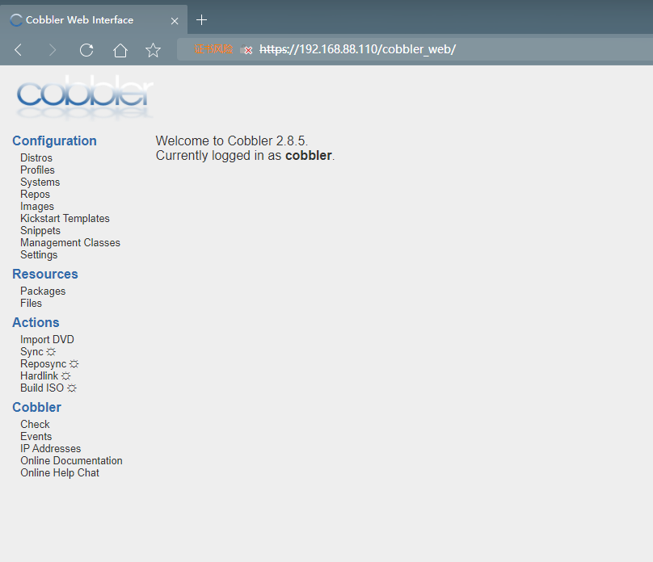
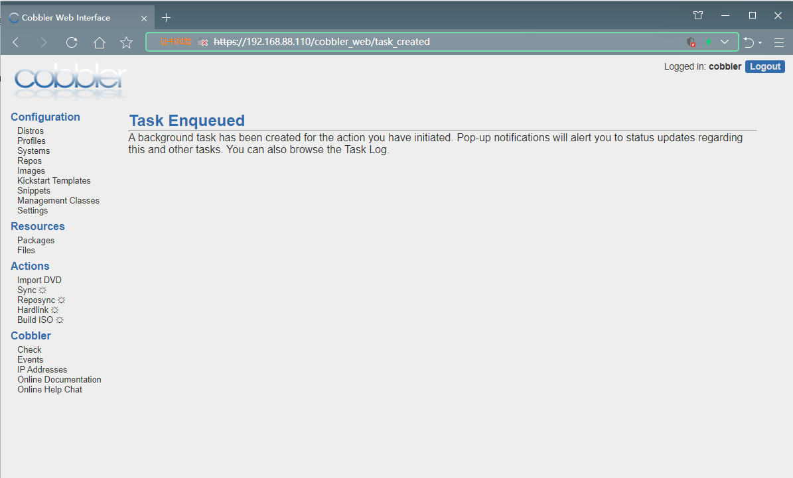

# 网络无人值守批量装机-cobbler

### 一、cobbler 简介

​ 上一节中的 pxe+kickstart 已经可以解决网络批量装机的问题了，但是环境配置过于复杂，而且仅针对某一个版本的操作系统进批量安装则无法满足目前复杂环境的部署需求。

​ 本小节所讲的 cobbler 则是基于 pxe+kickstart 技术的二次封装工具，简化了安装部署流程，增加了对多发行版的支持，并且有独立的 web 管理页面，极大方便了运维初级人员的学习和使用。

### 二、cobbler 工作原理

pxe+kickstart 工作原理：见上一节课件

cobbler 二次封装后的工作原理：


### 三、cobbler 部署流程

#### 1.准备工作

**搞一个大点容量的磁盘，后续空间需求很大！！！**

**添加一块新的磁盘，100GB，平均分成两个分区，然后，分别挂载至：/iso 和 /var/www 目录上，然后再进行后续实验。**

1.1 关闭防火墙和 SELinux

```shell
systemctl stop firewalld
systemctl disable firewalld
#关闭firewalld

setenforce 0
sed -i 's/SELINUX=enforcing/SELINUX=disabled/g' /etc/selinux/config
#关闭SELinux
```

1.2 配置连接到互联网

```shell
vim /etc/sysconfig/network-scripts/ifcfg-ens33
TYPE=Ethernet
PROXY_METHOD=none
BOOTPROTO=none
NAME=ens33
UUID=4b1e5f8a-1eda-4f66-bbb3-119bf51479fc
DEVICE=ens33
ONBOOT=yes
IPADDR=192.168.88.110
PREFIX=24
GATEWAY=192.168.88.2
DNS1=114.114.114.114

——————————————————————
systemctl restart network
```

1.3 配置基础网络 yum 源和 epel 扩展 yum 源

```shell
wget -O /etc/yum.repos.d/CentOS-Base.repo https://mirrors.aliyun.com/repo/Centos-7.repo
wget -O /etc/yum.repos.d/epel.repo http://mirrors.aliyun.com/repo/epel-7.repo

yum clean all
yum makecache
```

#### 2.安装 cobbler 和相关软件

2.1 安装软件

```shell
yum -y install cobbler cobbler-web tftp-server dhcp httpd xinetd
```

2.2 启动&设置开机自启动

```shell
systemctl start httpd cobblerd
systemctl enable httpd cobblerd
```

#### 3.配置 cobbler

3.1 检查 cobbler 配置，根据提示完成修改

```shell
cobbler check
——————————————————————
The following are potential configuration items that you may want to fix:

1 : The 'server' field in /etc/cobbler/settings must be set to something other than localhost, or kickstarting features will not work.  This should be a resolvable hostname or IP for the boot server as reachable by all machines that will use it.
2 : For PXE to be functional, the 'next_server' field in /etc/cobbler/settings must be set to something other than 127.0.0.1, and should match the IP of the boot server on the PXE network.
3 : change 'disable' to 'no' in /etc/xinetd.d/tftp
4 : Some network boot-loaders are missing from /var/lib/cobbler/loaders, you may run 'cobbler get-loaders' to download them, or, if you only want to handle x86/x86_64 netbooting, you may ensure that you have installed a *recent* version of the syslinux package installed and can ignore this message entirely.  Files in this directory, should you want to support all architectures, should include pxelinux.0, menu.c32, elilo.efi, and yaboot. The 'cobbler get-loaders' command is the easiest way to resolve these requirements.
5 : enable and start rsyncd.service with systemctl
6 : debmirror package is not installed, it will be required to manage debian deployments and repositories
7 : ksvalidator was not found, install pykickstart
8 : The default password used by the sample templates for newly installed machines (default_password_crypted in /etc/cobbler/settings) is still set to 'cobbler' and should be changed, try: "openssl passwd -1 -salt 'random-phrase-here' 'your-password-here'" to generate new one
9 : fencing tools were not found, and are required to use the (optional) power management features. install cman or fence-agents to use them

Restart cobblerd and then run 'cobbler sync' to apply changes.
——————————————————————
```

3.2 逐个问题解决

问题一&问题二：

```shell
vim /etc/cobbler/settings
原内容：allow_dynamic_settings: 0
修改为：allow_dynamic_settings: 1

systemctl restart cobblerd
#一定要先重启服务然后执行下面两条命令

vim /etc/cobbler/settings
server: 192.168.88.150
next_server: 192.168.88.150
pxe_just_once: 1
```

问题三：

```shell
vim  /etc/xinetd.d/tftp
disable = no
```

问题四：

```shell
cobbler get-loaders
#这个是原来的解决方案，但是最近官方做了重大更新，不在提供引导程序的下载功能了，so这个会报错

接下来是这个解决方案报错的解决方案！
#https://github.com/hbokh/cobbler-loaders

下载大神做好的文件
https://raw.githubusercontent.com/hbokh/cobbler-loaders/main/files/cobbler-loaders.tar.gz

yum -y install grub2-efi-x64-modules grub2-pc-modules

tar -xf /root/cobbler-loaders.tar.gz
cd /var/lib/cobbler/loaders/
cp -a /root/var/lib/cobbler/loaders/* ./


```

问题五：

```shell
systemctl enable rsyncd
systemctl start rsyncd
```

问题六：忽略即可，debian 相关配置

问题七：

```shell
yum -y install pykickstart
```

问题八：

```shell
openssl passwd -1 -salt 'root' '123456'
$1$root$j0bp.KLPyr.u9kgQ428D10

vim /etc/cobbler/settings
default_password_crypted: "$1$root$j0bp.KLPyr.u9kgQ428D10"
```

问题九：

```shell
yum -y install fence-agents

```

3.3 配置 cobbler-dhcp

```shell
vim /etc/cobbler/settings
manage_dhcp: 1

vim /etc/cobbler/dhcp.template
subnet 192.168.88.0 netmask 255.255.255.0 {
     option routers             192.168.88.2;
     option domain-name-servers    114.114.114.114;
     option subnet-mask          255.255.255.0;
     range dynamic-bootp         192.168.88.100 192.168.88.254;
#未列出所有，仅列出了修改内容

systemctl restart cobblerd
```

3.4 将 cobbler 控制的各个服务和文件复制到指定位置

```shell
cobbler sync

——————————————————————
如果又报错：dhcpd -t failed
原因：python文件内命令错误
解决：
cp -a /usr/lib/python2.7/site-packages/cobbler/modules/sync_post_restart_services.py /tmp
cd /tmp
vim sync_post_restart_services.py
#修改前dhcp_restart_command = "service %s restart" % dhcp_service_name
#修改后dhcp_restart_command = "/usr/bin/systemctl restart %s " % dhcp_service_name
python -m compileall  sync_post_restart_services.py
python -O -m compileall  sync_post_restart_services.py
#重新编译
cp -a *  /usr/lib/python2.7/site-packages/cobbler/modules/
#复制粘贴回去
systemctl restart cobbler
cobbler sync
——————————————————————
```

3.5 将所有服务全部重启一遍

```shell
systemctl restart httpd rsyncd dhcpd xinetd cobblerd tftp.socket tftp
```

### 四、导入镜像绑定 ks 文件

#### 1.导入镜像

```shell
mkdir /iso/centos7.6/
mount -r /dev/sr0 /iso/centos7.6/
cobbler import --name="CentOS-7.6-x86_64" --path=/iso/centos7.6
#此步骤极其缓慢，主要原因是镜像太大了
#cobbler会将镜像中的所有安装文件拷贝到本地一份，放在/var/www/cobbler/ks_mirror下的CentOS-7.2-x86_64目录下。因此/var/www/cobbler目录必须具有足够容纳安装文件的空间。

ll /var/www/cobbler/ks_mirror/

cobbler profile list
#列出所有导入的镜像列表
```

#### 2.生成 ks 模板文件

```shell
cd /var/lib/cobbler/kickstarts/
#可以直接导入之前pxe用的文件
vim centos7.cfg
url --url=http://192.168.88.110/cobbler/ks_mirror/CentOS-7.6-x86_64/
#修改为指定目录
```

#### 3.查看指定镜像的 profile 配置文件，将 ks 文件绑定到指定镜像

```shell
cobbler profile report --name=CentOS-7.6-x86_64
#根据提示修改内容，将自定义ks文件绑定到该镜像上
cobbler profile edit --name=CentOS-7.6-x86_64 --kickstart=/var/lib/cobbler/kickstarts/centos7.cfg
```

#### 4.创建测试虚拟机进行验证

​ 注意：虚拟机的内存必须大于 2G，否则会出现无法安装的情况

### 五、设置 web 管理终端

修改 cobbler 的 web 验证模式

```shell
grep -A 1 "\[authentication\]" /etc/cobbler/modules.conf
[authentication]
module = authn_configfile

htdigest -c /etc/cobbler/users.digest Cobbler admin
Adding password for admin in realm Cobbler.
New password:
Re-type new password:
```

使用浏览器登陆 cobbler_web 管理终端

```shell
https://192.168.88.110/cobbler_web
#此处必须使用https协议进行登陆
```

进入 web 管理首页



导入镜像文件

```
导入镜像文件有个前置条件，需要创建目录，并将光盘文件进行挂载
mount -o loop /root/CentOS6.8-xxxxx.iso /iso/centos6.8
```


添加 ks 模板文件


将 ks 文件和指定的镜像绑定在一起


最后执行配置同步



cobbler 配置相关目录

### 六、相关目录和命令帮助

配置文件目录：  
/etc/cobbler  
/etc/cobbler/settings : cobbler 主配置文件  
/etc/cobbler/iso/: iso 模板配置文件  
/etc/cobbler/pxe: pxe 模板文件  
/etc/cobbler/power: 电源配置文件  
/etc/cobbler/user.conf: web 服务授权配置文件  
/etc/cobbler/users.digest: web 访问的用户名密码配置文件  
/etc/cobbler/dhcp.template : dhcp 服务器的的配置末班  
/etc/cobbler/dnsmasq.template : dns 服务器的配置模板  
/etc/cobbler/tftpd.template : tftp 服务的配置模板  
/etc/cobbler/modules.conf : 模块的配置文件

数据目录：  
/var/lib/cobbler/config/: 用于存放 distros，system，profiles 等信息配置文件  
/var/lib/cobbler/triggers/: 用于存放用户定义的 cobbler 命令  
/var/lib/cobbler/kickstart/: 默认存放 kickstart 文件  
/var/lib/cobbler/loaders/: 存放各种引导程序 ，镜像目录  
/var/www/cobbler/ks_mirror/: 导入的发行版系统的所有数据  
/var/www/cobbler/images/ : 导入发行版的 kernel 和 initrd 镜像用于远程网络启动  
/var/www/cobbler/repo_mirror/: yum 仓库存储目录

日志目录：  
/var/log/cobbler/installing: 客户端安装日志  
/var/log/cobbler/cobbler.log : cobbler 日志

cobbler commands 介绍：  
cobbler check 核对当前设置是否有问题  
cobbler list 列出所有的 cobbler 元素  
cobbler report 列出元素的详细信息  
cobbler sync 同步配置到数据目录,更改配置最好都要执行下  
cobbler reposync 同步 yum 仓库  
cobbler distro 查看导入的发行版系统信息  
cobbler system 查看添加的系统信息  
cobbler profile 查看配置信息
